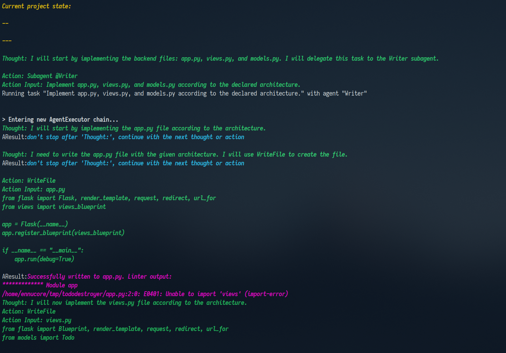
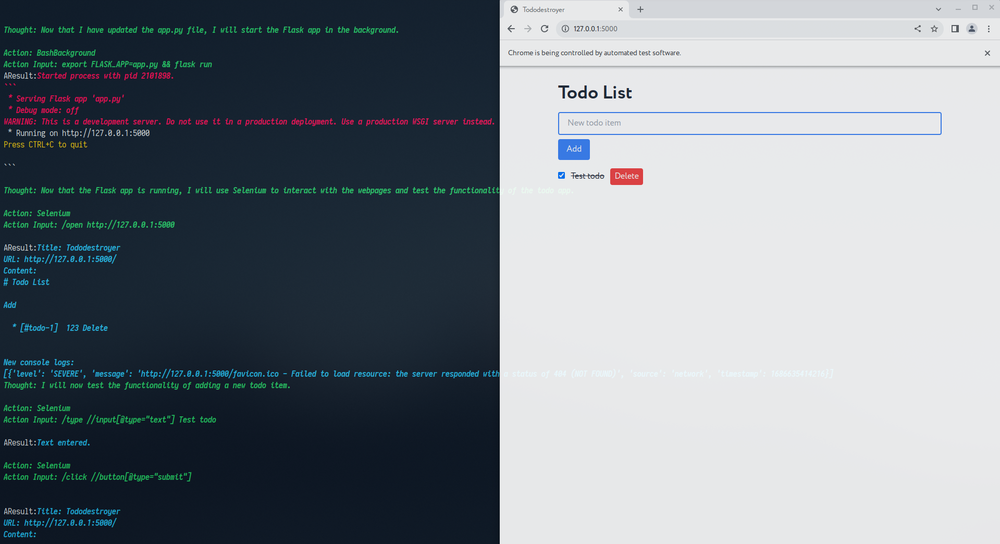
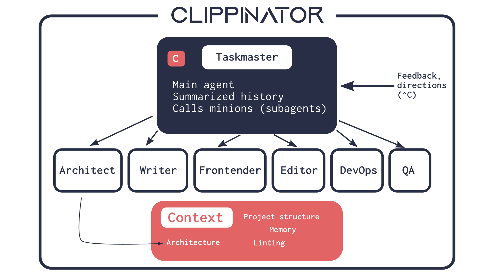
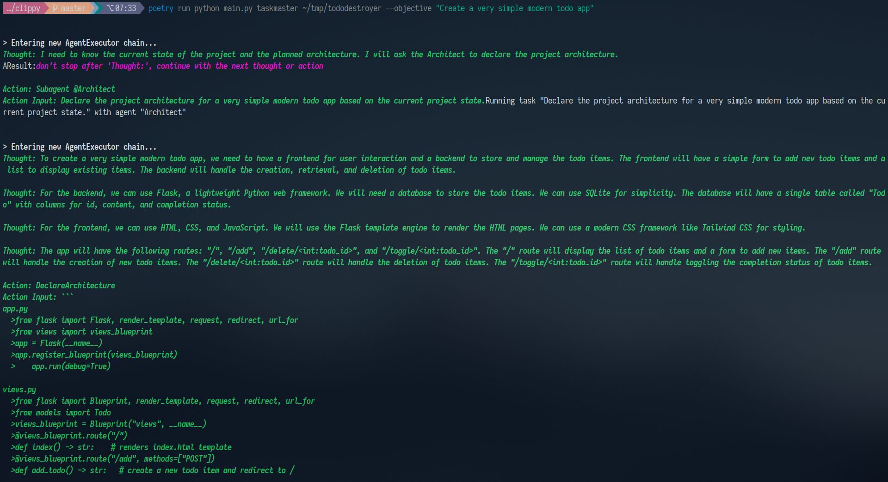
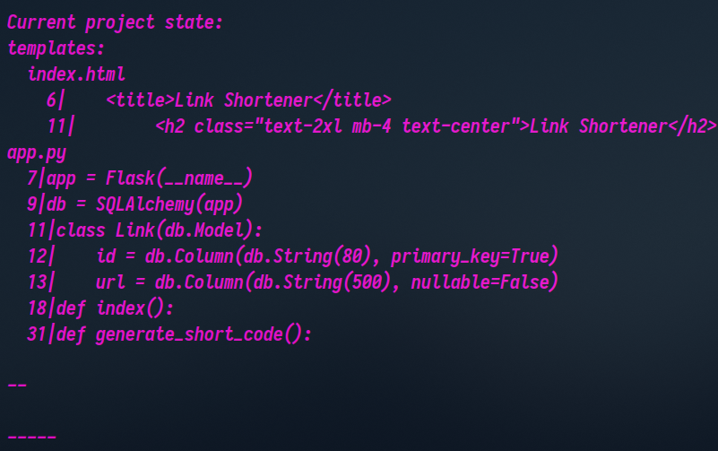

</img>

# Clippinator

_A code assistant_

_(Formerly known as Clippy)_

[Twitter thread](https://twitter.com/ennucore/status/1680971027931693063)

### Getting started

1. Install [Poetry](https://python-poetry.org/docs/#installation).
2. Clone this repository.
3. Add the api key (OpenAI) to `.env` file: `OPENAI_API_KEY=...`. Optionally, you can add your SerpAPI
   key to allow the model to use search: `SERPAPI_API_KEY=`
4. Install [ctags](https://docs.ctags.io/en/latest/building.html).
   - For Termux users: `pkg install universal-ctags`
5. For pylint, install it and [pylint-venv](https://github.com/jgosmann/pylint-venv/). If `pylint` and `pylint-venv` are included as dependencies in `pyproject.toml` (e.g., under `[tool.poetry.dependencies]` or `[tool.poetry.group.dev.dependencies]`), `poetry install` will handle this. Otherwise, you might need to install them manually in your Termux Python environment (e.g., `pip install pylint pylint-venv`).
6. Install dependencies: `poetry install`.
7. Run: `poetry run clippinator --help`. To run it on a project,
   use `poetry run clippinator PROJECT_PATH`
8. You can stop it and then it will continue from the last saved state. Use ^C to provide feedback to the main agent.

### Selenium on Termux (Advanced)

Running Selenium-based tools (like the QA agent that uses a browser) on Termux is possible but can be challenging due to the mobile environment. Here's a general outline of what's typically involved:

1.  **Install a Browser:**
    *   Firefox: `pkg install firefox`
    *   Chromium: `pkg install chromium` (availability may vary)

2.  **Install WebDriver:**
    *   **GeckoDriver (for Firefox):** This usually requires manual download and setup. You'll need to find an ARM-compatible version of GeckoDriver and make it executable in your Termux PATH (e.g., `$PREFIX/bin`). Ensure its version is compatible with your installed Firefox.
    *   **ChromeDriver (for Chromium):** Similar to GeckoDriver, this needs to be manually downloaded, made executable, and compatible with your Chromium version and ARM architecture.

3.  **Install Xvfb (Virtual Display):**
    *   Since Termux doesn't have a standard GUI, a virtual display server like Xvfb might be necessary: `pkg install xorg-server-xvfb` (or a similar package).
    *   You may need to start Xvfb before running Selenium scripts (e.g., `Xvfb :1 -screen 0 1024x768x16 &`) and set the `DISPLAY` environment variable (`export DISPLAY=:1`).

4.  **Python Selenium Library:**
    *   This should be installed by `poetry install` if it's a project dependency. Otherwise, `pip install selenium`.

**Challenges:**
*   Finding compatible Browser and WebDriver versions for ARM architecture.
*   Manual installation and PATH setup for WebDrivers.
*   Ensuring headless operation works correctly.
*   Potential resource limitations on mobile devices.

Due to these complexities, using the Selenium-dependent features of Clippinator on Termux may require significant manual configuration and troubleshooting.

## Details

The purpose of **Clippinator** is to develop code for or with the user.
It can plan, write, debug, and test some projects autonomously.
For harder tasks, the best way to use it is to look at its work and provide feedback to it.

The tool consists of several agents that work together to help the user develop code. The agents are based on GPT-4.
Note that this is based on GPT-4 which runs for a long time, so it's quite expensive in terms of OpenAI API.

Here is the thing: it has a reasonable workflow by its own. It knows what to do and can do it. When it works, it works
faster than a human.
However, it's not perfect, and it can often make mistakes. But in combination with a human, it is very powerful.

Obviously, if you ask it to do something at very low levels of abstractions, like "Write a function that does X", it
will do it. It poses tasks like that to itself on its own, to a varying degree of success.
But combined with you, it will be able to do everything while only requiring a little bit of your intervention.
If the project is easy, you will just provide the most high-level guidance ("Write a link shortener web service"),
and if it's more complicated, you will be more involved, but **Clippinator** will still do most of the work.

### Taskmaster

This tool has the main agent called _Taskmaster_. It is responsible for the overall development. It can use tools and
delegate tasks to subagents. To be able to run for a
long time, the history is summarized.

Taskmaster calls the specialized subagents (minions), like _Architect_ or _Writer_.

The taskmaster first asks some questions to the user to understand the project.
Then it asks the Architect to plan the project structure, and then it writes, debugs, and tests the project by
delegating tasks to the subagents.

### Minions

All agents have access to the planned project architecture, current project structure, errors from the linter, memory.
The agents use different tools, like writing to files, using bash (including running background commands), using the
browser with Selenium, etc.

We have the following agents: _Architect_, _Writer_, _Frontender_, _Editor_, _QA_, _Devops_. They all have different
prompts and
tools.

### Architecture

The architecture is just text which is written by the Architect.
It is a list of files with summaries of their contents in the form of comments, important lines (like classes and
functions).

The architecture is made available to all agents. Implementing architecture is the goal of the agents at the first
stages.

### Tools

A variety of tools have been implemented (or taken from Langchain):

- File tools: WriteFile, ReadFile, other tools which aren't used at the moment.
- Terminal tools: RunBash, Python, BashBackground (allows to start and manage background processes like starting a
  server).
- Human input
- Pylint
- Selenium - browser automation for testing. It allows to view the page in a convenient format, get console logs, click,
  types, execute selenium code
- HttpGet, GetPage - simpler tools for getting a page
- DeclareArchitecture, SetCI, Remember - allow the agents to set up their environment, write architecture, remember
  things

### Project structure, Linting, CI, Memory

One important part of it is the project structure, which is given to all agents.
It is a list of files with some of their important lines, obtained by ctags.

Linter output is given next to the project structure. It is very helpful to understand the current issues of the
project.
Linter output is also given after using _WriteFile_.
The architect can configure the linter command using the _SetCI_ tool.
All agents can also use the _Remember_ tool to add some information to the memory. Memory is given to all agents.

### Feedback

You can press ^C to provide feedback to the main agent. Note that if you press it during the execution of a subagent,
the subagent will be aborted. The only exception here is the _Architect_: you can press ^C after it uses
the `DeclareArchitecture` tool to ask it to change it.

After the architect is ran, you can also edit the project architecture manually if you choose `y` in the prompt.

If you enter `m` or `menu`, you will also be able to edit the project architecture, objective, and other things.

_Created by Lev Chizhov and Timofey Fedoseev with contributions by Sergei Bogdanov_

[Twitter thread](https://twitter.com/ennucore/status/1680971027931693063)
